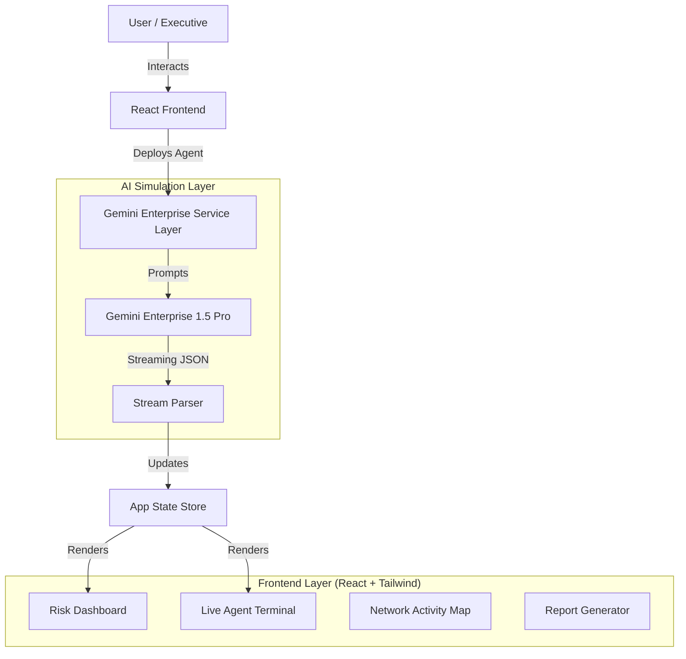

# Sentinel AI: Architecture & Implementation Plan

## 1. System Overview
Sentinel AI is a React-based Single Page Application (SPA) powered by **Google Gemini Enterprise** models. It simulates the behavior of autonomous risk agents by generating realistic audit logs, forensic findings, and executive reports based on specific risk scenarios.

## 2. High-Level Architecture

## 3. Key Components

### A. Frontend (The "Glass")
*   **Framework:** React 18 with TypeScript.
*   **Styling:** Tailwind CSS for a futuristic, "Dark Mode" command center aesthetic.
*   **Visualization:** 
    *   `recharts` for analytics (Pie charts, Area charts).
    *   Custom SVG-based Network Visualizer (`ActivityVisualizer.tsx`) to represent agent "movement" across infrastructure.

### B. The AI Engine (The "Brain")
*   **Model:** `gemini-1.5-pro` (Gemini Enterprise Edition).
*   **Integration:** `@google/genai` SDK.
*   **Pattern:** **Streaming Generative UI**.
    *   Instead of waiting for the full audit to finish, we stream the response.
    *   The prompt instructs Gemini Enterprise to output **newline-delimited JSON**.
    *   This allows the UI to render "logs" line-by-line as they are generated, creating the illusion of real-time processing.

### C. Prompt Engineering Strategy
The core intelligence lies in `services/prompts.ts`. We use **Persona-Based Prompting**:
*   **System Instruction:** "You are Sentinel-7, an elite autonomous Risk Assurance Agent..."
*   **Context Injection:** We inject the specific Risk ID, Control Description, and Capability (e.g., "IAM_ASSURANCE").
*   **Output Constraints:** Strict JSON format to ensure the frontend can parse logs vs. final results programmatically.

## 4. Implementation Steps (Prototype to Pilot)

### Phase 1: The Prototype (Current State)
*   **Goal:** Visual storytelling and executive buy-in.
*   **Mechanism:** AI *simulates* the audit. It generates plausible logs and findings based on the risk description, but does not actually connect to a database.
*   **Success Metric:** "Does the executive understand the value proposition?"

### Phase 2: Tool Use Integration (The "Real" Pilot)
*   **Goal:** Actual verification of data.
*   **Mechanism:** Implement Gemini Enterprise **Function Calling (Tools)**.
    *   Define tools: `sqlQuery()`, `fetchJiraTicket()`, `checkActiveDirectory()`.
    *   Instead of Hallucinating logs, the Agent will call `checkActiveDirectory(user="jdoe")`.
    *   The system executes the real API call and feeds the result back to Gemini.
*   **Stack Upgrade:** 
    *   Backend Node.js/Python wrapper to hold secrets and execute actual API calls.

### Phase 3: RAG (Retrieval Augmented Generation)
*   **Goal:** Context-aware auditing.
*   **Mechanism:**
    *   Ingest company policies (PDFs) into a Vector Database.
    *   When the agent checks a control, it first retrieves the specific policy requirement (e.g., "Passwords must be 12 chars").
    *   It then verifies the technical config against that specific retrieved policy.

## 5. Security & Governance
*   **API Keys:** Stored in environment variables (client-side for prototype, server-side for production).
*   **Human-in-the-Loop:** The "Report Modal" serves as the human review gate before any automated remediation (e.g., locking an account) would occur in a real system.